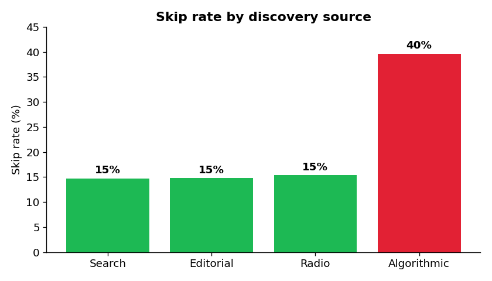
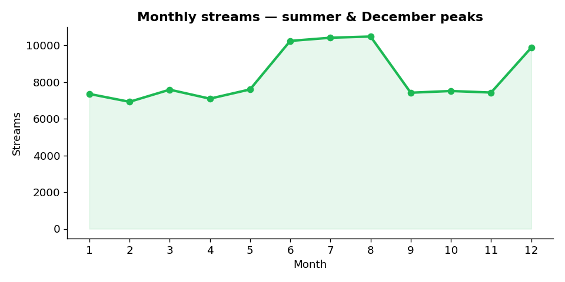
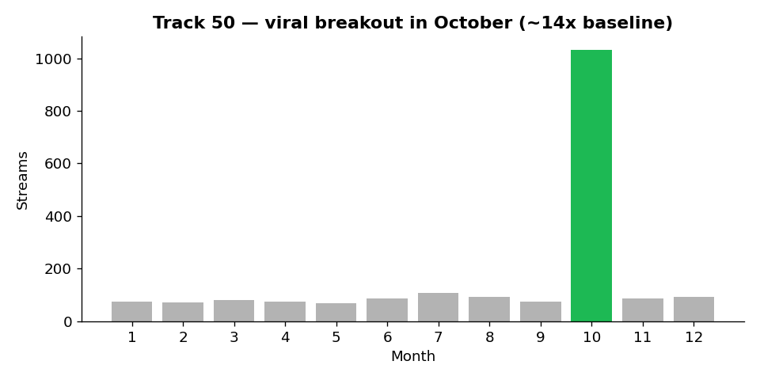
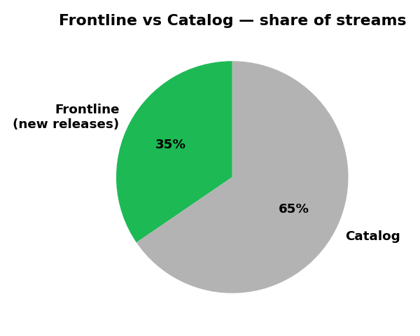

# 🎧 Music Streaming Analytics — Product Analytics for a Streaming Platform

[](https://github.com/matteobalducci/music-streaming-analytics/actions/workflows/ci.yml)

An end-to-end analytics project that models the **digital twin of a music streaming service** (Spotify / Apple Music / YouTube Music style) and answers the question every streaming company cares about:

> *"How do our users consume music, and how do we optimize their experience to grow retention and revenue?"*

This is not a "count the streams" dashboard. It measures **stream quality, discovery efficiency, and catalog strategy** — the metrics product and content teams at streaming platforms actually use.

**Stack:** Python (pandas, NumPy) · dimensional modeling (star schema) · SQL / BigQuery · dbt · Power BI

---

## 📊 What the data shows

<table>
<tr>
<td width="50%"></td>
<td width="50%"></td>
</tr>
<tr>
<td width="50%"></td>
<td width="50%"></td>
</tr>
</table>

Dataset: **1.2M listening events · 50,000 users · 100 tracks · full year 2024.**

---

## 🧠 The metrics that matter (and why)

| Metric | What it measures | Why a streaming company cares |
|---|---|---|
| **Skip Rate** | % of streams skipped in the first seconds | A high-volume, high-skip catalog signals a **retention problem**, not success. Skips are as strong a signal as likes. |
| **Discovery Efficiency** | Skip rate broken down by `stream_source` | Algorithmic recommendations skip at **~40%** vs **~15%** for user-driven sources → the recommender is over-serving mismatched content. |
| **Frontline vs Catalog** | Streams on new releases vs back-catalog | Labels and platforms run **different margin and marketing strategies** for new hits vs classics. Is growth driven by new drops or the catalog? |
| **Seasonality** | Monthly / weekend listening cycles | Summer (+40%) and December (+30%) peaks demand **capacity and content planning**. |
| **Virality** | Single-track breakout detection | Track 50 explodes **~14x** in October — the kind of signal that triggers editorial and playlist decisions. |

Full analytical narrative → [`docs/business_questions.md`](docs/business_questions.md)

---

## 🏗️ Architecture

```
Raw events (CSV / generator)
        │
        ▼
  BigQuery raw tables ──► dbt staging (clean, typed, tested)
                                   │
                                   ▼
                         dbt marts (star schema)
                          fct_streams · dim_track · dim_time · dim_platform
                                   │
                    ┌──────────────┴──────────────┐
                    ▼                              ▼
             Power BI dashboard             Ad-hoc SQL analysis
             (DAX product metrics)          (sql/analysis/)
```

**Dimensional model (star schema):**

- `fct_streams` — one row per listening event (the grain)
- `dim_track` — catalog intelligence (genre, duration, `is_frontline`)
- `dim_time` — calendar with weekend/seasonality flags
- `dim_platform` — Spotify / Apple Music / YouTube Music / SoundCloud

---

## 📁 Repository structure

```
music-streaming-analytics/
├── README.md
├── data/
│   ├── D_Tracks.csv  D_Platform.csv  D_Time.csv   # dimensions (full)
│   └── sample/F_Streams_sample.csv                # 100k-row sample of the fact table
├── scripts/
│   ├── generate_datasets.py     # reproducible synthetic-data generator (seeded)
│   ├── load_bigquery.py         # load the star schema into BigQuery (+ .sh variant)
│   ├── validate_data.py         # data-quality gate (used in CI)
│   └── make_charts.py           # regenerate the README charts
├── sql/
│   ├── ddl/                      # BigQuery table definitions (star schema)
│   └── analysis/                 # the business questions, answered in SQL
├── dbt/
│   └── streaming/                # staging + marts models with data-quality tests
├── dashboard/
│   └── Music_Stream_Dashboard.pbix
└── docs/
    ├── business_questions.md
    └── screenshots/
```

---

## ▶️ Reproduce it

Everything is driven by a `Makefile` (`make help` lists the targets):

```bash
make install          # install Python dependencies
make generate         # regenerate the full 1.2M-row dataset (seeded, deterministic)
make validate         # run the data-quality gate (referential integrity, invariants)
make charts           # rebuild the README charts from the data
```

### Run it on BigQuery

```bash
# Auth once, then load the star schema (partitioned + clustered)
gcloud auth application-default login
make load PROJECT=your-gcp-project          # Python loader (scripts/load_bigquery.py)
# or:  PROJECT=your-gcp-project ./scripts/load_bigquery.sh   # bq CLI

# Build + test the dbt models on top of the loaded tables
cd dbt/streaming && dbt deps && dbt build
```

The full fact table (~1.2M rows / 63 MB) is regenerated by the script and is **not** committed;
a 100k-row sample lives in [`data/sample/`](data/sample/) so the repo is clone-and-run, and
`make load` falls back to that sample automatically if the full file is absent.

**CI** ([`.github/workflows/ci.yml`](.github/workflows/ci.yml)) regenerates a small dataset on every
push and runs the data-quality checks, plus a SQL lint (`sqlfluff`, BigQuery dialect).

---

## 🎯 Why this project

I built the data generator to reflect **real streaming-industry dynamics** — circadian listening, weekend lift, algorithmic-vs-editorial discovery, viral breakouts, frontline/catalog split — so the analysis exercises the same problems a product-analytics team faces. The goal was a portfolio piece that proves I can go from **raw event data → dimensional model → product metrics → decision-ready dashboard**, not just plot a CSV.

**Author:** Matteo Balducci — Data Analyst
[LinkedIn](https://www.linkedin.com/in/matteo-balducci/) · [GitHub](https://github.com/matteobalducci)
