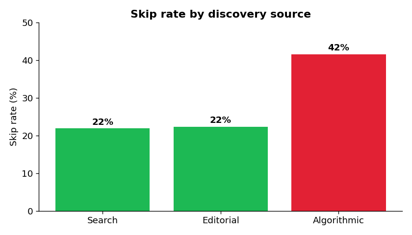
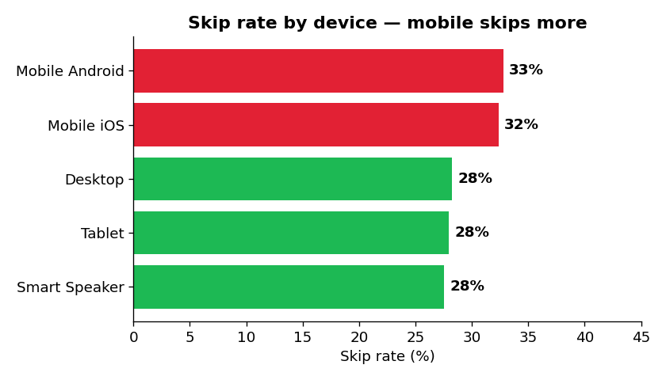
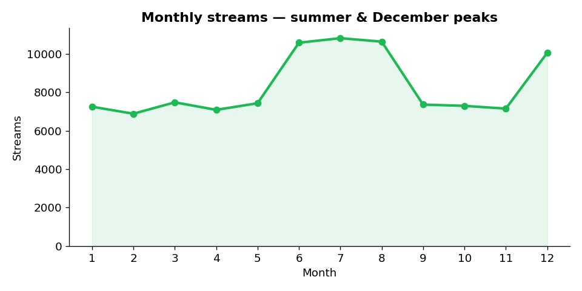
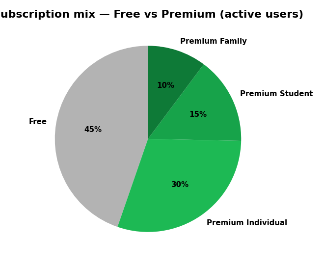

# Business Questions & Findings

This project treats the dataset as the **digital twin of a streaming platform** and answers the questions a product-analytics team would actually ask. Figures come from the full 1.23M-event dataset (2024).

---

## 1. Is our recommender serving music people want? (Discovery Efficiency)

**Finding:** Algorithmic recommendations are skipped **~42%** of the time, versus **~22%** for Editorial and Search.

**So what:** Volume hides a retention problem. If two-fifths of algorithmically-served streams are abandoned in the first seconds, the recommender is padding stream counts with mismatched content. The lever is model relevance, not more recommendations.

---

## 2. Where do skips happen? (Device experience)

**Finding:** Mobile (iOS/Android) skips **~33%** vs **~28%** on desktop/tablet/speaker.

**So what:** The skip problem is concentrated on mobile, not on any one country — so the fix is a better on-device recommender and mobile UX, not geo-targeted marketing.

---

## 3. Where does the money come from? (Monetization)

**Finding:** Revenue and **RPM (revenue per 1,000 active users)** split by plan. Premium tiers (55% of active users) drive the paid revenue; Free (45%) is the conversion opportunity.

**So what:** Growing users without growing RPM would signal low-value acquisition. Tracking both together keeps volume and monetization honest. See `sql/analysis/business_questions.sql` Q3.

---

## 4. Are we keeping users? (Retention — done right)

**Finding:** A naïve `active / signed-up` KPI reads ~97% — but that is **reach, not retention**. Using `churn_date`, **17.7%** of users churn within the year → **real retention ≈ 82%**, and month-over-month retention sits at **88–96%** with a September dip.

**So what:** The 97% number would hide a real 18% churn in an executive review. The corrected measure (and the DAX for it) is the difference between a metric that *looks* good and one that *drives* decisions. See Q4.

---

## 5. When do we need capacity and content? (Seasonality)

**Finding:** Listening peaks in **summer** and **December**, with a consistent **weekend lift**.

**So what:** Infrastructure capacity and editorial calendars should be pre-loaded ahead of these windows.

---

## 6. Volume vs quality by genre

**Finding:** Ranking genres by *completion rate* rather than raw streams reorders the "top performers" — high volume does not equal high engagement.

**So what:** Editorial support for long-term retention should weight completion and low skip, not just the loudest volume. See Q6.

---

## 7. Subscription mix

**Finding:** Free **~45%** · Premium Individual **~30%** · Premium Student **~15%** · Premium Family **~10%** of active users.

**So what:** Free is the single largest segment — the conversion funnel starts there.

